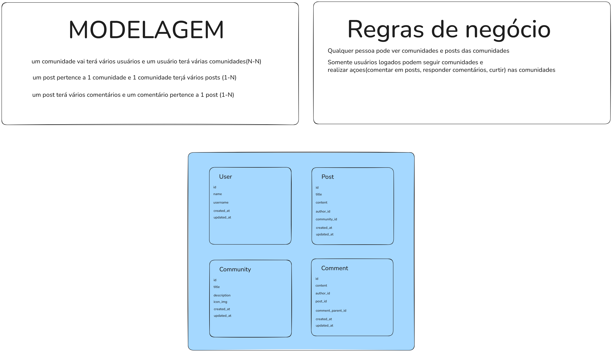

## Modelagem

Primeiro desenvolvi uma modelagem básica do sistema com as entidades e suas propriedades que seriam necessárias
com base no design do Figma.

A modelagem contém as seguintes entidades: `User`, `Community`, `Post` e `Comment`, que contêm relacionamentos
simples entre si, identificadas pelas chaves estrangeiras na imagem acima,
que não contém propriedades específicas nas suas tabelas de relacionamento(pivô).

## Painel Admin - Filament

Após modelar o sistema, comecei o desenvolvimento pelo sistema de admin do Filament, para ter mais facilidade para
gerir os dados durante o desenvolvimento da aplicação, montando os resources de cada entidade e as suas relações,
procurei deixar os relacionamentos mais acesseis utilizando o recurso de tabs do proprio Filament.
Por exemplo, a tela de edição de uma comunidade contém tabs para visualização de membros e posts da própria.

## Frontend User não admin - Blade + Tailwind CSS + Livewire

Para desenvolvimento do frontend e para usar a autenticação/sessão, como foi sugerido,
optei por usar o Login que o `Filament` oferece atraves do uso de um painel `guest` que não é necessário o login
para usar a aplicação desde lado e para permitir acesso a recursos do próprio `Filament` nessa parte do sistema,
foi trabalhoso e tomou boa parte do tempo por não eu não ter tido uma experiência além do básico com o `Filament` antes,
mas está funcional e, caso seja necessário, é possível integrar `Actions` do Filament no Frontend como usei na navbar
uma action para ter acesso à página de login e logout.

Concluida a configuração do painel `guest` com layouts e autenticação funcional,
comecei a desenvolver as páginas do Figma para o usuário final, utilizei as tecnologias que já estavam disponíveis no
template do projeto: `Blade`, `Tailwind CSS`, `Livewire` e componentes do `Filament`.

OBS: Frontend do usuário não admin está incompleto faltando interatividade e responsividade, porém a estrutura básica
com layout desktop seguindo o design proposto do Figma está pronta para
melhorias(componentização, design mobile, organização de pastas) e seguir com o desenvolvimento.

De forma geral o projeto segue o estrutura de projeto padrão do `Laravel` e do `Filament`, sei que tem algumas melhorias
que podem ser feitas relacionadas a componentização e organização de pastas.
Não usei Ia para desenvolvimento de alguma feature específica, somente como code complete do Copilot integrado a IDE e
tirar dúvidas durante o desenvolvimento "substituindo o Google".
